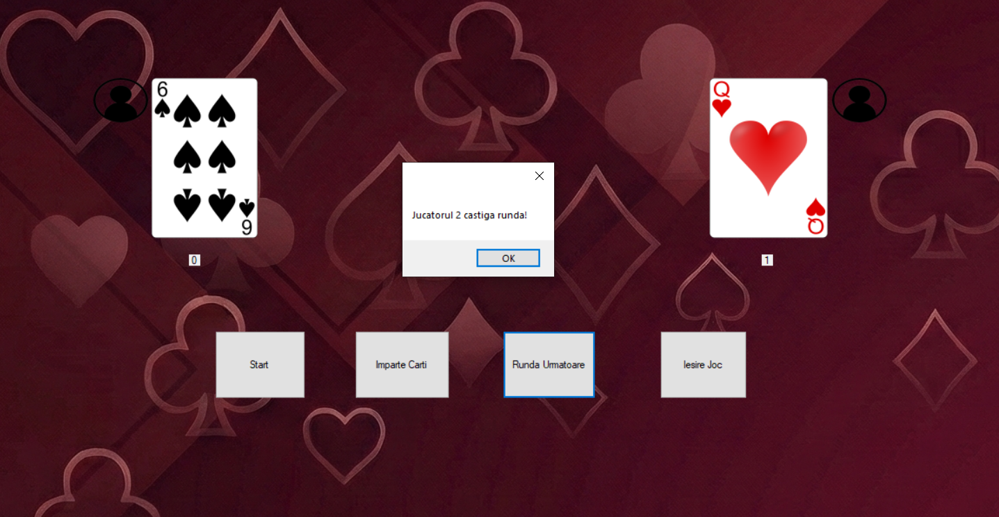

# ♠️ War Card Game


> A desktop implementation of the classic **War card game** — two players draw cards and the highest card wins the round. Built with C# and Windows Forms using Object-Oriented Programming.

---

## 📸 Preview



---

## 🎮 How to Play

War is a simple card game between two players:

1. The deck is shuffled and split equally between **Player** and **Computer**
2. Each round, both players flip their top card
3. The player with the **higher card wins** both cards
4. In case of a **tie** — War! Each player plays additional cards face-down, then one face-up
5. The game ends when one player has **all 52 cards** (or runs out)

---

## ✨ Features

- 🃏 Full 52-card deck with suits and values
- 🖼️ **Real card images** — PNG artwork for all 52 cards
- 🤖 Player vs Computer gameplay
- 🔀 Shuffled deck every new game
- 📊 Live score tracking for both players
- 🖥️ Visual GUI built with Windows Forms
- 🔁 Start / Deal buttons

---

## 🏗️ Project Structure

```
Joc-Razboi/
│
├── Proiect Razboi/
│   ├── Carte.cs          # Card class (suit, value, image path)
│   ├── Pachet.cs         # Deck class (create, shuffle, deal)
│   ├── Joc.cs            # Game logic (rounds, current cards, score)
│   ├── Form1.cs          # Windows Forms UI (buttons, labels, card images)
│   ├── imagini_carti/    # PNG images for all 52 cards
│   └── Program.cs        # Entry point
│
├── Proiect Razboi.slnx   # Visual Studio solution file
└── .gitignore
```

---

## 🧠 Object-Oriented Design

This project demonstrates core **OOP principles** in C#:

| Class | Responsibility |
|---|---|
| `Carte` | Represents a single card — stores value, suit, and the path to its PNG image |
| `Pachet` | Creates and manages the full 52-card deck — shuffle and deal logic |
| `Joc` | Controls game flow — tracks current cards (`CarteCurrentaJucator1/2`), scores, and round results |
| `Form1` | Windows Forms UI — handles button clicks (`imparte_Click`, `Butonstart_Click`), displays card images and score labels |

**OOP concepts applied:**
- **Encapsulation** — each class manages its own data and exposes only what's needed
- **Inheritance** — shared logic between Player and Computer player
- **Abstraction** — the Form only calls high-level game methods, without knowing internal logic
- **Single Responsibility** — each class does exactly one thing

---

## 🚀 Getting Started

### Prerequisites

- [Visual Studio 2022+](https://visualstudio.microsoft.com/) (Community is free)
- .NET Framework / .NET 6+

### Run the Game

```bash
# Clone the repository
git clone https://github.com/marioteodor18/Joc-Razboi.git

# Open in Visual Studio
# Double-click: Proiect Razboi.slnx

# Press F5 to build and run
```

---

## 📚 What I Learned

This project is part of my C# / OOP learning journey. Through building it, I practiced:

- Designing a **multi-class OOP architecture** in C#
- Building **Windows Forms** GUI applications
- Implementing **game logic** with classes and methods
- Using **inheritance** to avoid code duplication
- Thinking about **separation of concerns** (UI vs logic)

---

## 🗺️ Future Improvements

- [ ] Score tracker across multiple rounds
- [ ] Animated card flip effect
- [ ] Sound effects
- [ ] Difficulty levels for the computer player
- [ ] Multiplayer (two human players)

---

## 👤 Author

**Roman Mario**
📌 GitHub: [@marioteodor18](https://github.com/marioteodor18)

---

## 📄 License

This project is open source and available under the [MIT License](LICENSE).
